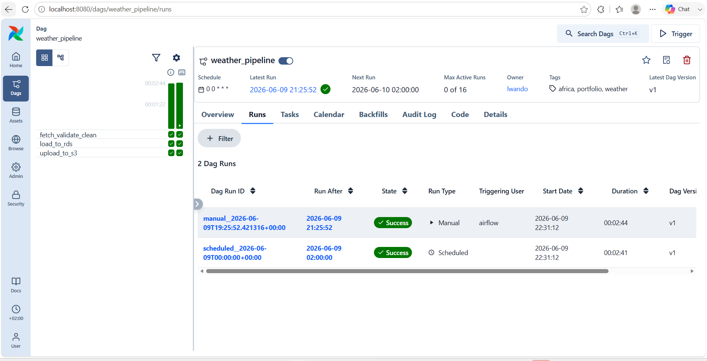
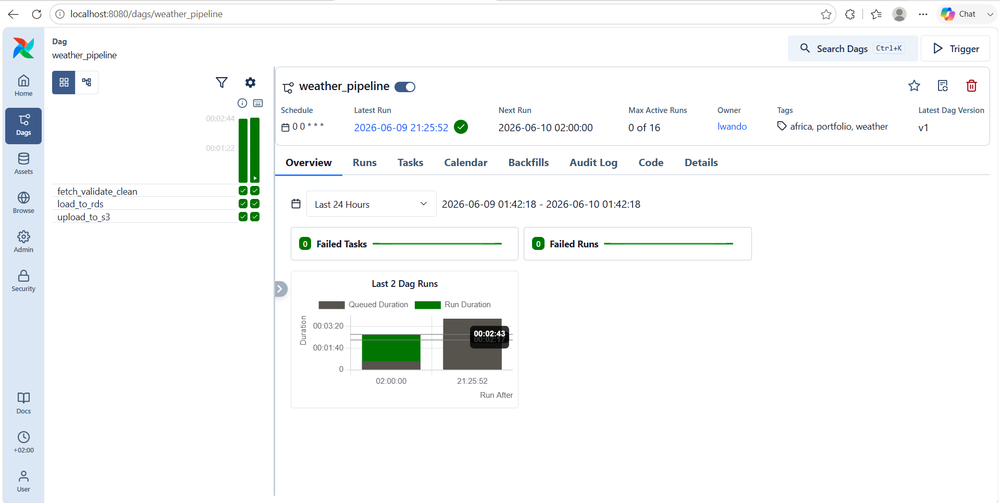
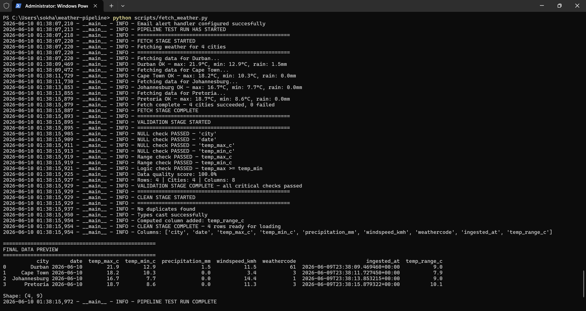

# Weather Data Orchestrated Pipeline

An automated weather data pipeline that fetches, validates, cleans, and loads daily weather data for 4 South African cities into AWS RDS PostgreSQL, with S3 backup and email alerting — fully orchestrated with Apache Airflow inside Docker.

## What it does

Every day at 2am, Airflow automatically:
1. Fetches live weather data from Open-Meteo API for Durban, Cape Town, Johannesburg and Pretoria
2. Validates data quality and calculates a quality score
3. Cleans and transforms the data
4. Loads it into AWS RDS PostgreSQL
5. Backs up raw CSV to AWS S3
6. Sends an email alert if any task fails

## Tech Stack

| Tool | Purpose |
|------|---------|
| Python | Data fetching, validation, cleaning |
| Apache Airflow | Pipeline orchestration and scheduling |
| Docker + docker-compose | Containerisation |
| AWS RDS PostgreSQL | Cloud database storage |
| AWS S3 | Raw data backup |
| Open-Meteo API | Free real-time weather data |

## Architecture
Open-Meteo API
↓
fetch_weather.py (fetch → validate → clean)
↓
load_rds.py → AWS RDS PostgreSQL
↓
upload_s3.py → AWS S3
↓
Airflow DAG (orchestrates all tasks daily)
↓
Email Alert (on failure)

## Project Structure
```text
weather-pipeline/
├── dags/
│   └── weather_pipeline.py    # Airflow DAG definition
├── scripts/
│   ├── fetch_weather.py       # Fetch, validate, clean
│   ├── load_rds.py            # Load to AWS RDS
│   └── upload_s3.py           # Backup to AWS S3
├── docker-compose.yaml        # Airflow + Docker setup
├── .env                       # Environment variables (not committed)
└── README.md
```

## Data Quality

Every pipeline run calculates a data quality score checking:
- Null values in critical columns
- Temperature range validation (-60°C to 60°C)
- Logic checks (max temp >= min temp)
- Duplicate detection

Current score: **100%**

## Cities Tracked

- Durban, South Africa
- Cape Town, South Africa  
- Johannesburg, South Africa
- Pretoria, South Africa

## How to Run

### Prerequisites
- Docker Desktop
- AWS account (free tier)
- Gmail account with App Password

### Setup

1. Clone the repository:
```bash
git clone https://github.com/lwando-sokhanyile/weather-pipeline.git
cd weather-pipeline
```

2. Create a `.env` file with your credentials:

```
AIRFLOW_UID=50000
MAIL_ID=your@gmail.com
MAIL_PASSWORD=your-app-password
DB_HOST=your-rds-endpoint.rds.amazonaws.com
DB_PORT=5432
DB_NAME=weather_db
DB_USER=postgres
DB_PASSWORD=your-db-password
S3_BUCKET=your-s3-bucket
AWS_ACCESS_KEY_ID=your-key
AWS_SECRET_ACCESS_KEY=your-secret
AWS_DEFAULT_REGION=eu-west-1
```

3. Start Airflow:
```bash
docker-compose up airflow-init
docker-compose up -d
```

4. Open http://localhost:8080 (login: airflow/airflow)
5. Trigger the `weather_pipeline` DAG

## What I Learned

- Airflow DAG structure and task dependencies
- Docker volume mounting and environment variable management
- AWS RDS and S3 setup and connection
- Data validation patterns and quality scoring
- Production-grade logging and error handling
- Debugging containerised applications

## Screenshots

### DAG Success Runs


### Task Graph


### Pipeline Output
