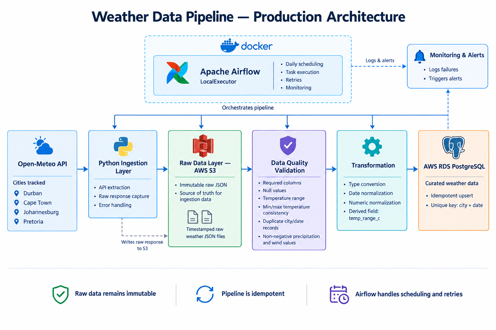
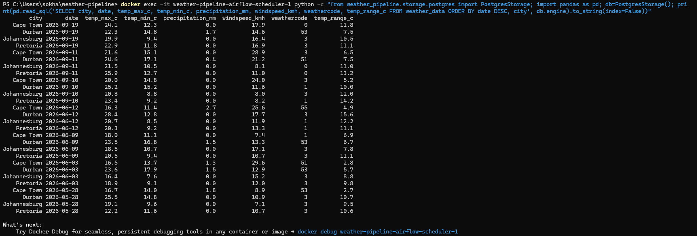
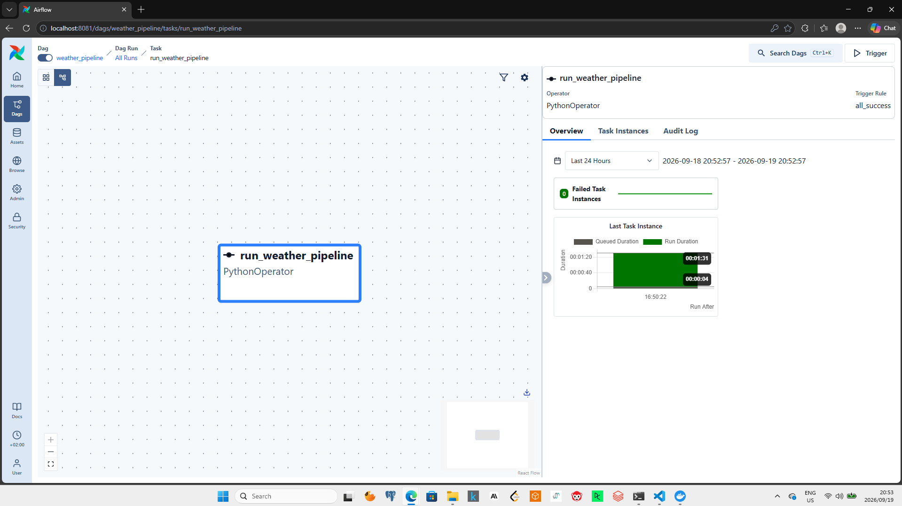
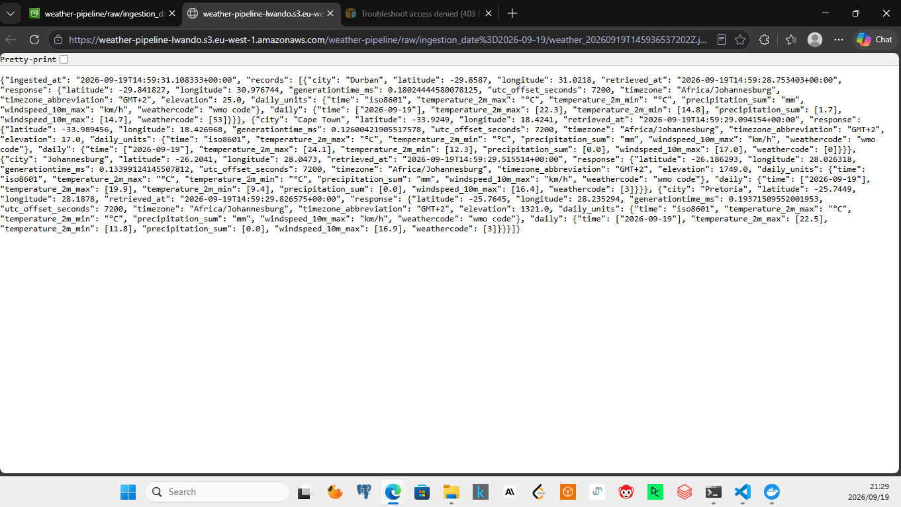
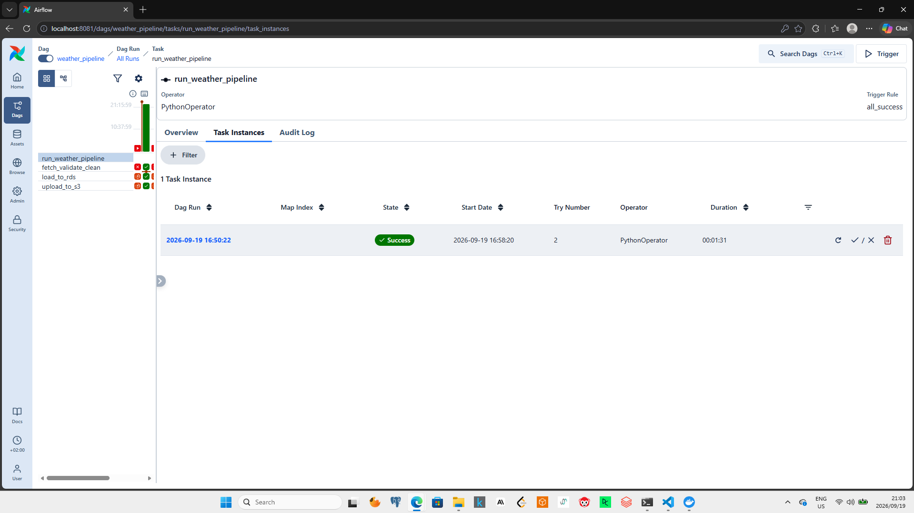

# Weather Data Pipeline

A production-style data engineering pipeline that collects daily weather data for four South African cities, preserves raw source data in Amazon S3, validates and transforms the data, and loads curated records into PostgreSQL on AWS RDS.

The pipeline is containerized with Docker and orchestrated with Apache Airflow for scheduled execution, retries, logging, and monitoring.



## The Problem

Weather APIs provide useful data, but consuming an API is only the beginning of a data engineering workflow.

A reliable pipeline needs to answer questions such as:

* What happens if an API request fails?
* Can the original source response be recovered?
* How is bad data detected before reaching the database?
* Can the pipeline safely run more than once?
* How are extraction, validation, transformation, and storage separated?
* How are failures retried and monitored?
* Can the system be reproduced outside the developer's machine?

This project was built around those requirements rather than as a simple API-to-database script.

## Pipeline

```text
Open-Meteo API
      |
      v
Python Ingestion
      |
      +--------------> AWS S3
      |                Raw JSON
      |
      v
Data Validation
      |
      v
Transformation
      |
      v
AWS RDS PostgreSQL
```

Apache Airflow sits above the pipeline and handles orchestration, scheduling, execution, retries, and monitoring.

## Architecture

### 1. Extraction

The pipeline uses the Open-Meteo API to collect daily weather observations for:

* Durban
* Cape Town
* Johannesburg
* Pretoria

The API interaction is isolated inside a dedicated client layer rather than being embedded directly into the pipeline orchestration.

HTTP failures and individual city failures are logged so that a problem with one source request does not automatically hide the status of the remaining extraction work.

### 2. Raw Data Layer

Raw API responses are written to Amazon S3 before downstream processing.

Example:

```text
weather-pipeline/
└── raw/
    └── ingestion_date=2026-09-19/
        └── weather_20260919T145936537202Z.json
```

The raw layer provides a recoverable representation of what the source returned during a pipeline run.

Raw responses are treated as immutable rather than being overwritten by transformed data.

### 3. Data Validation

Validation happens before data is written to the curated PostgreSQL layer.

The pipeline checks:

* Required columns
* Empty datasets
* Null values
* Temperature ranges
* Maximum temperature >= minimum temperature
* Non-negative precipitation
* Non-negative wind speed
* Duplicate city/date records

Invalid data is rejected before it can silently contaminate the downstream dataset.

### 4. Transformation

Validated data is converted into a consistent analytical format.

Transformations include:

* Date normalization
* Numeric type conversion
* Consistent field handling
* Derived temperature range

The pipeline creates:

```text
temp_range_c = temperature_max_c - temperature_min_c
```

Transformation is deliberately separated from extraction and validation so that each stage has a clear responsibility.

### 5. PostgreSQL / AWS RDS

Validated and transformed records are loaded into PostgreSQL hosted on AWS RDS.

The storage layer uses batch upserts based on:

```text
city + date
```

This makes the pipeline idempotent.

Running the same pipeline again does not create duplicate city/date records.

#### Curated Layer — PostgreSQL / Amazon RDS

Validated and transformed weather records are stored in PostgreSQL on Amazon RDS using an idempotent upsert strategy.



## Orchestration

Apache Airflow is responsible for running the pipeline.

The DAG currently uses a Python task that invokes the pipeline service.

This keeps the orchestration layer lightweight while the actual data-processing responsibilities remain inside the application code.

Airflow handles:

* Daily scheduling
* Task execution
* Retries
* Task state tracking
* Logging
* Monitoring

The pipeline is loaded lazily inside the Airflow task rather than during DAG parsing. This prevents heavier Python dependencies from blocking Airflow's DAG discovery process.

The DAG intentionally contains a single task. The application pipeline itself handles ingestion, validation, transformation, and storage.



## Why LocalExecutor?

The local deployment uses:

```text
Airflow + LocalExecutor
```

instead of a Celery-based architecture.

This was a deliberate engineering decision.

This project does not require distributed task execution. Introducing Redis, Celery workers, and additional infrastructure would increase operational complexity without solving a requirement the pipeline currently has.

LocalExecutor provides the scheduling, execution, retry, and monitoring capabilities required by this project while keeping the deployment manageable.

## Reliability and Idempotency

Reliability was treated as part of the pipeline design rather than something added afterwards.

### Retry Handling

Airflow retries failed pipeline tasks according to the DAG configuration.

### Idempotent Database Loading

Records use a city/date uniqueness constraint and PostgreSQL upsert behavior.

Therefore:

```text
Run 1 -> 4 records written
Run 2 -> existing records updated
```

rather than:

```text
Run 1 -> 4 records
Run 2 -> 8 records
```

### Raw Data Preservation

The raw API response is stored independently of the transformed database representation.

This makes the raw S3 layer useful for investigation and recovery when downstream processing changes.

#### Raw Layer — Amazon S3

Raw Open-Meteo responses are stored as immutable JSON objects in S3 before validation and transformation.



## Data Model

The curated weather dataset contains fields including:

| Field                | Description                                        |
| -------------------- | -------------------------------------------------- |
| `city`               | Weather observation city                           |
| `date`               | Observation date                                   |
| `temperature_max_c`  | Maximum temperature in Celsius                     |
| `temperature_min_c`  | Minimum temperature in Celsius                     |
| `precipitation_mm`   | Daily precipitation                                |
| `wind_speed_max_kmh` | Maximum wind speed                                 |
| `temp_range_c`       | Temperature difference between maximum and minimum |

The database enforces uniqueness across:

```text
city + date
```

Indexes are also used to support common city/date access patterns.

## Project Structure

```text
weather-pipeline/
│
├── dags/
│   └── weather_pipeline.py
│
├── src/
│   └── weather_pipeline/
│       ├── clients/
│       │   └── open_meteo.py
│       │
│       ├── ingestion/
│       │   ├── extract.py
│       │   └── ingest.py
│       │
│       ├── validation/
│       │   └── quality.py
│       │
│       ├── transformation/
│       │   └── transform.py
│       │
│       ├── storage/
│       │   ├── s3.py
│       │   └── postgres.py
│       │
│       ├── monitoring/
│       │   └── alerts.py
│       │
│       ├── config.py
│       └── pipeline.py
│
├── tests/
│   ├── unit/
│   └── integration/
│
├── sql/
│   └── schemas/
│       └── weather_data.sql
│
├── docs/
│   ├── architecture.md
│   ├── data_dictionary.md
│   └── incidents.md
│
├── screenshots/
│
├── Dockerfile
├── docker-compose.yaml
├── requirements.txt
├── .gitignore
└── README.md
```

## Technology Stack

| Technology     | Role                                                      |
| -------------- | --------------------------------------------------------- |
| Python         | Extraction, validation, transformation and pipeline logic |
| Pandas         | Data manipulation and transformation                      |
| PostgreSQL     | Curated data storage                                      |
| AWS RDS        | Managed PostgreSQL database                               |
| Amazon S3      | Raw data storage                                          |
| Apache Airflow | Scheduling, orchestration and retries                     |
| Docker         | Reproducible execution environment                        |
| SQLAlchemy     | Database connectivity and loading                         |
| Open-Meteo     | Weather data source                                       |

## Testing

The pipeline has been tested beyond simply checking whether the API returns data.

### Successful End-to-End Execution

The pipeline successfully extracted weather data for four cities, stored the raw responses in S3, validated and transformed the data, and wrote the final records to PostgreSQL.



### End-to-End Validation

The complete pipeline has successfully executed:

```text
API extraction
      |
      v
Raw S3 ingestion
      |
      v
Data validation
      |
      v
Transformation
      |
      v
PostgreSQL upsert
```

### Database Verification

The pipeline was verified to write weather records to PostgreSQL while preserving the city/date uniqueness constraint.

### Idempotency Testing

The pipeline was executed repeatedly to verify that rerunning the same data does not create duplicate records.

### Airflow Testing

The Airflow DAG has been verified for:

* Successful DAG parsing
* No import errors
* Task discovery
* Manual execution
* Retry behavior
* Successful task completion

## Example Successful Run

A successful pipeline execution produces logs similar to:

```text
Weather pipeline started

Weather extraction succeeded for Durban
Weather extraction succeeded for Cape Town
Weather extraction succeeded for Johannesburg
Weather extraction succeeded for Pretoria

Raw weather data stored in S3

Weather data validation passed

Weather data transformation completed

Weather pipeline completed successfully: 4 rows written
```

The same pipeline has also been executed successfully through Airflow.

## Engineering Decisions

### Raw S3 Before Transformation

The source response is preserved before validation and transformation.

**Reason:** downstream processing should not destroy the original source representation.

### Separate Pipeline Layers

Extraction, validation, transformation, and storage are implemented as separate components.

**Reason:** each component has a single responsibility and can be tested independently.

### PostgreSQL Upserts

The database uses idempotent upsert behavior.

**Reason:** scheduled pipelines can safely be retried or rerun without creating duplicate records.

### Airflow Orchestration

Airflow manages execution instead of embedding scheduling logic inside the Python application.

**Reason:** orchestration concerns belong outside the data-processing code.

### LocalExecutor

The local Airflow deployment uses LocalExecutor instead of Celery.

**Reason:** distributed execution is unnecessary for the current workload and would add infrastructure without providing a required capability.

### Dockerized Execution

Airflow and its dependencies run inside Docker.

**Reason:** the pipeline should be reproducible and isolated from the host environment.

## Failure Investigation

One of the useful outcomes of building this project was dealing with failures that were not caused by the weather API itself.

During Airflow execution, a task initially failed because of an infrastructure/executor timing issue.

The configured retry mechanism then allowed Airflow to execute the task again successfully.

This demonstrated an important distinction:

```text
Pipeline failure
       !=
Data failure
       !=
Infrastructure failure
```

The project documents these incidents and the resulting architectural changes in:

```text
docs/incidents.md
```

## Running the Project

### Prerequisites

* Docker Desktop
* AWS account
* AWS S3 bucket
* AWS RDS PostgreSQL instance
* Open-Meteo API access
* Gmail account with an App Password if email alerting is enabled

### Configuration

Create a local `.env` file containing the required environment variables.

Do not commit credentials to Git.

Example structure:

```text
AIRFLOW_UID=50000

DB_HOST=your-rds-endpoint
DB_PORT=5432
DB_NAME=weather_db
DB_USER=postgres
DB_PASSWORD=your-password

S3_BUCKET=your-s3-bucket
AWS_ACCESS_KEY_ID=your-access-key
AWS_SECRET_ACCESS_KEY=your-secret-key
AWS_DEFAULT_REGION=your-region
```

### Start Airflow

```bash
docker compose up airflow-init
docker compose up -d
```

Airflow is exposed locally on:

```text
http://localhost:8081
```

Once Airflow is running, trigger:

```text
weather_pipeline
```

from the Airflow interface.

## Observability

The repository includes screenshots demonstrating successful execution and Airflow task state.

### Pipeline Output


## What This Project Demonstrates

This project demonstrates practical experience with:

* API-based data ingestion
* Raw data preservation
* AWS S3 data storage
* Data-quality validation
* Data transformation
* PostgreSQL data modeling
* AWS RDS
* Idempotent database loading
* Airflow orchestration
* Retry handling
* Dockerized execution
* Python application structure
* Unit and integration testing
* Logging and failure investigation
* Debugging infrastructure issues

The goal was not simply to move weather data from an API into a database.

The goal was to build a pipeline that can be understood, tested, rerun, monitored, and recovered when something goes wrong.

## Repository

GitHub: https://github.com/lwando-sokhanyile/weather-pipeline
